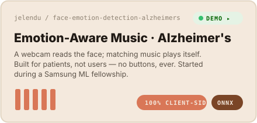

  
  
  
  

I build tools where data meets real people — pipelines that <b>test themselves</b>, dashboards that <b>explain themselves</b>, and models that earn their keep outside a notebook.

  
  
  

## 📌 Live investigations

Everything here is **real and running** — click through and use it.

<table>
<tr>
<td width="50%" valign="top">
  
  

    
    
  

</td>
<td width="50%" valign="top">
  
  

    
    
  

</td>
</tr>
</table>

## 🐍 The pipeline never sleeps

My reconciliation engine commits fresh data to this account **every 30 minutes** — the snake below eats that contribution graph, and regenerates itself daily with its own GitHub Action.

<picture>
  <source media="(prefers-color-scheme: dark)" srcset="https://raw.githubusercontent.com/jelendu/jelendu/output/github-snake-dark.svg"/>
  
</picture>

## 🧰 Toolbox

**Languages & querying** &nbsp;

**Pipelines & modeling** &nbsp;

**BI, apps & systems** &nbsp;

## 📈 The paper trail

  
  

